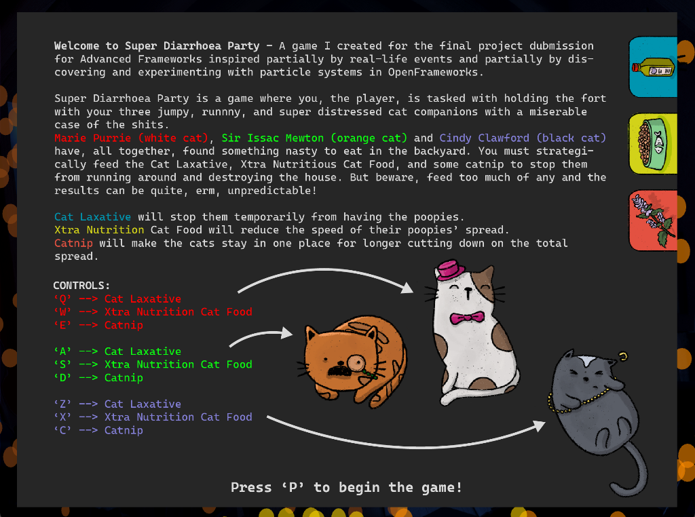
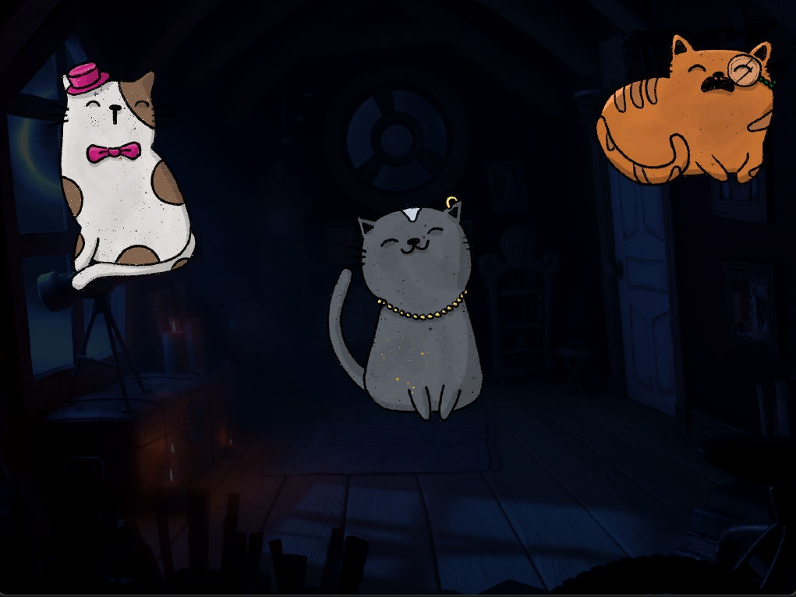

# Super Diarrhoea Party

## Notes
- Video Demonstration of the Project: 
- Gallery of Screengrabs from the project:

## Project Description

Super Diarrhoea Party is a game where you, the player, is tasked with holding the fort with your three jumpy, runnny, and super distressed cat companions with a miserable case of the shits. 
Marie Purrie (white cat), Sir Issac Mewton (orange cat) and Cindy Clawford (black cat) have, all together, found something nasty to eat in the backyard. You must strategically feed the Cat Laxative, Xtra Nutritious Cat Food, and some catnip to stop them from running around and destroying the house. But beware, feed too much of any and the results can be quite, erm, unpredictable!

Cat Laxative will stop them temporarily from having the poopies.
Xtra Nutrition Cat Food will reduce the speed of their poopies’ spread.
Catnip will make the cats stay in one place for longer cutting down on the total spread.

The game uses 9 different buttons to create a control system as chaotic as the situation the player finds themselves in. Each cat needs to be fed 3 things, each having its own button. 

## Gallery

 Splash Screen of the game showing the Project Description and the control scheme.

 The start of the game. Everything is relatively calm and all the cats are happy!

 The cats are wary and sppoked, and the diarrhoea is extravagant!

 Absolute Pandemoinium. The cats are moving around the room spewing the shits everywhere!

 In control again? - Feeding the cats food, laxatives, and catnip seems to have calmed them down, at least for now.

## Process

For this project, I explored the following ideas and used the following references:   

- **Perlin Noise** - The positioning and particle system uses a combination of ofRandom and ofNoise functions to make drastic and smooth random motions both ways. [Dan Shiffman](https://shiffman.net/)'s [online tutorial](https://www.youtube.com/watch?v=Qf4dIN99e2w&list=PLRqwX-V7Uu6bgPNQAdxQZpJuJCjeOr7VD) for understanding and using Perlin Noise for Processing helped me out a lot in this respect!
- **Particle Systems** - The diarrhoea is question is created using particle systems. I used [Dan Buzzo](https://buzzo.com/)'s original Particle system class, modified strategically to form the game. You can find his original YouTube video series describing the class and its implementation [here](https://www.youtube.com/watch?v=XghI0B4EhQI) and the GitHub repository to the source code [here](https://github.com/danbz/art-and-code). 
- 
