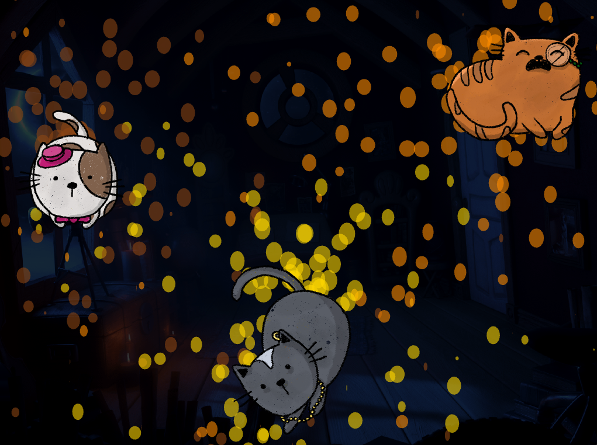
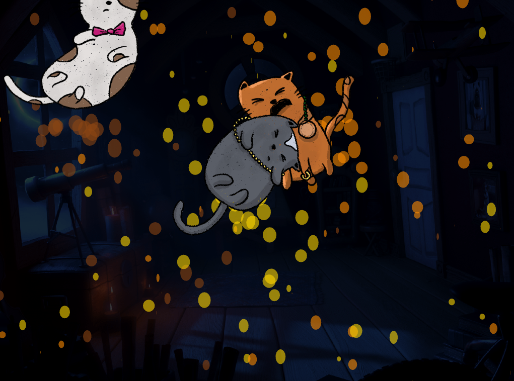
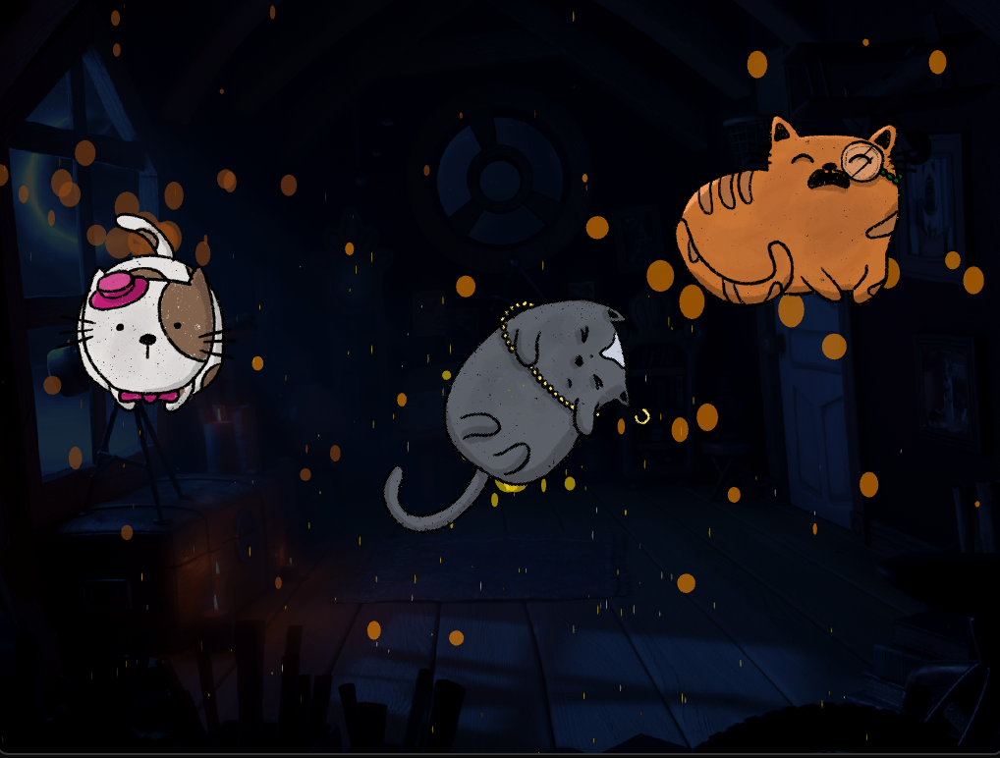
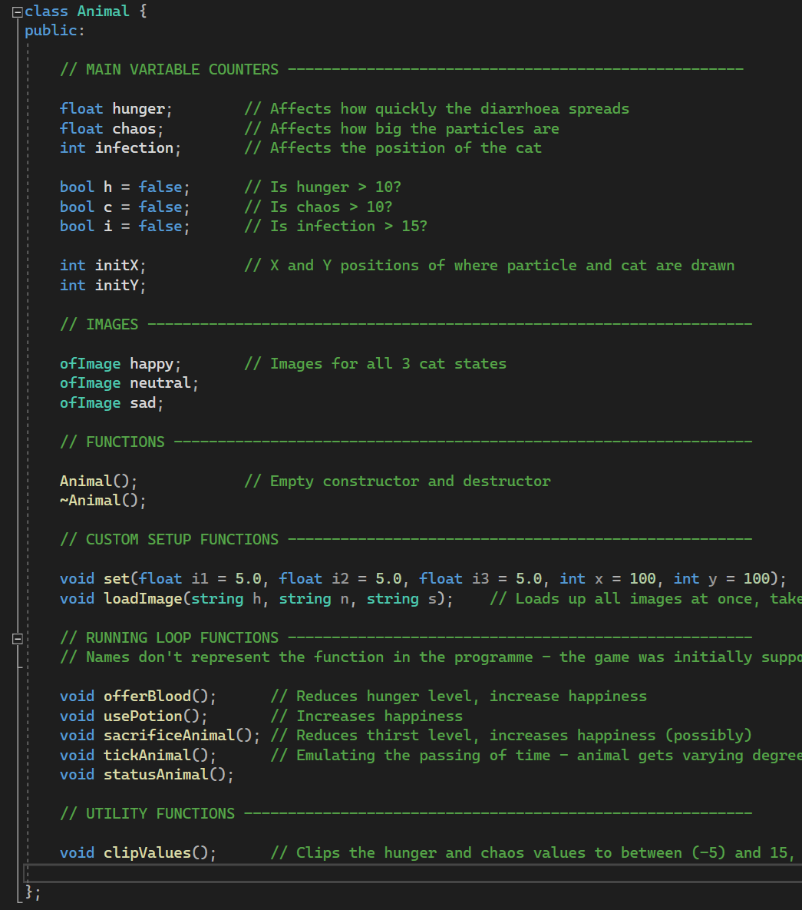
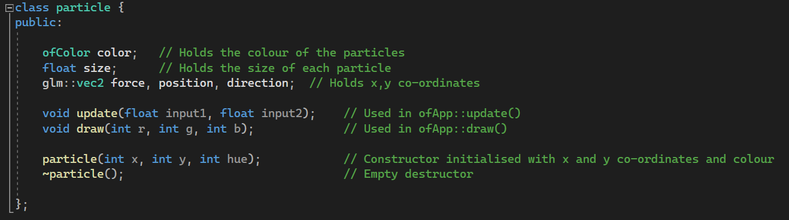
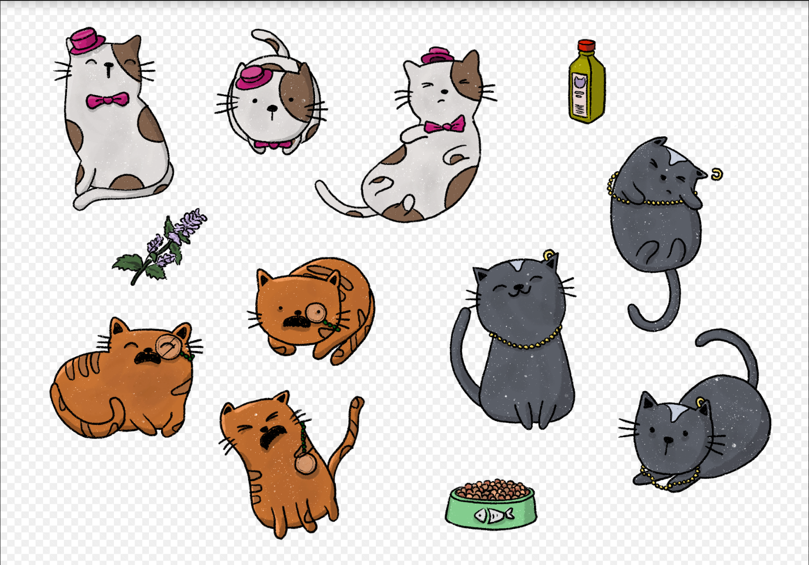
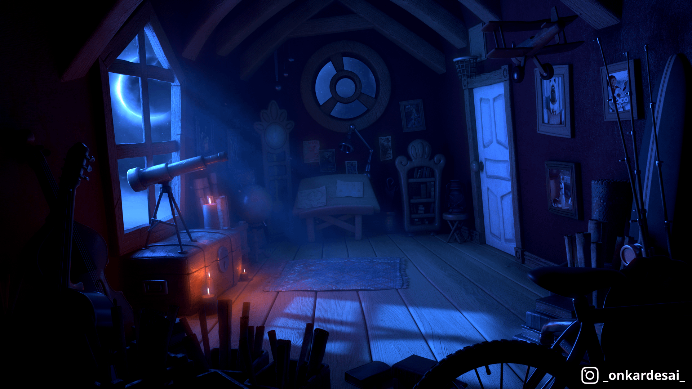

# Super Diarrhoea Party!!
Advait Ukidve - Advanced Frameworks Final Project - UAL Creative Computing Institute - March 2023

## Notes
- Video Demonstration of the Project: [Panopto](https://ual.cloud.panopto.eu/Panopto/Pages/Viewer.aspx?id=8295c239-0aeb-4402-942e-afc700c4ed9b) or [YouTube](https://youtu.be/56pgCNIZ7PY)
- Gallery of Screengrabs from the project [here](./Gallery/)

## Project Description

Super Diarrhoea Party is a game where you, the player, is tasked with holding the fort with your three jumpy, runnny, and super distressed cat companions with a miserable case of the shits. 
Marie Purrie (white cat), Sir Issac Mewton (orange cat) and Cindy Clawford (black cat) have, all together, found something nasty to eat in the backyard. You must strategically feed the Cat Laxative, Xtra Nutritious Cat Food, and some catnip to stop them from running around and destroying the house. But beware, feed too much of any and the results can be quite, erm, unpredictable!

Cat Laxative will stop them temporarily from having the poopies.
Xtra Nutrition Cat Food will reduce the speed of their poopies’ spread.
Catnip will make the cats stay in one place for longer cutting down on the total spread.

The game uses 9 different buttons to create a control system as chaotic as the situation the player finds themselves in. Each cat needs to be fed 3 things, each having its own button. 

## Gallery

 Splash Screen of the game showing the Project Description and the control scheme.

 The start of the game. Everything is relatively calm and all the cats are happy!

 The cats are wary and spooked, and the diarrhoea is extravagant! Orange still seems fine though, surprisingly

 Absolute Pandemoinium. The cats are moving around the room spewing the shits everywhere!

 In control again? - Feeding the cats food, laxatives, and catnip seems to have calmed them down, at least for now.

## Code Structure
The code uses two custom classes - A Particle class to create a particle effects, and an Animal class to control the drawing of cats, their stats, their controls, and the functioning of the game. 3 Instances of each class are used in the ofApp.h main class file.  

#### Animal Class - [Header](./src/animal.h)
The Animal class is a custom class written by me based on a previous homework project. That is also the reason some of the variable names don't exactly fit within the narrative context of this game, but bear with me. Each instance of the ***Animal class*** indicates one of the cats in the game. They contain variables that track their ***hunger***(h), ***chaos***(c) value and ***infection***(i) value. These 3 for the core of the game influencing the drawing of the particle system (diarrhoea system) using the Particle class.    
The inbuilt [methods](./src/animal.cpp) contain ***tickAnimal()*** which increases the ***h, c, and i*** values once every tick by a random number within a range. The tick is triggered once every 5 seconds in the ***ofApp draw()*** method. The Animal class also contains methods ***usePotion(), feedBlood(),*** and ***sacrificeAnimal()*** that are triggered using ***keyPressed()*** observer method inbuilt into OpenFrameworks. These methods decrease the ***h,c, and i*** values by random numbers within a range defined by a pone dimensional Perlin Noise spread.

#### Particle Class - [Header](./src/ofApp.h)
The particle class is a modified version of [Dan Buzzo's](https://buzzo.com/) original particle system class for OpenFrameworks. It contains two main methods - the ***update()*** and the ***draw()*** methods used within the respective ofApp methods along with a constructor for every particle. Every particle is created using values such as size, position, colour, etc. The ***update()*** method updates these values according to conditions laid out by the Animal class. The main ***ofApp draw()*** loop contains the ***draw()*** method preceded by the addition of one new particle instance every loop to the end of a vector that stores all create dparticles. The particles are instantiated with a random size (within a range of 30-40) pixels, a position that is a random increment around an ***init(x,y)*** position and a constant colour with 150 on the alpha channel. The size decreases every frame by a factor of ***Animal.hunger***. The speed of dispersion increases by a factor of ***Animal.chaos***. The position ***init(x,y)*** around which particles are instantiated changes based on ***Animal.infection.***

 The Animal class header

 The particle class header
   
## Process

For this project, I explored the following ideas and used the following references:   

- **Perlin Noise** - The positioning and particle system uses a combination of ofRandom and ofNoise functions to make drastic and smooth random motions both ways. [Dan Shiffman](https://shiffman.net/)'s [online tutorial](https://www.youtube.com/watch?v=Qf4dIN99e2w&list=PLRqwX-V7Uu6bgPNQAdxQZpJuJCjeOr7VD) for understanding and using Perlin Noise for Processing helped me out a lot in this respect!
- **Particle Systems** - The diarrhoea is question is created using particle systems. I used [Dan Buzzo](https://buzzo.com/)'s original Particle system class, modified strategically to form the game. You can find his original YouTube video series describing the class and its implementation [here](https://www.youtube.com/watch?v=XghI0B4EhQI) and the GitHub repository to the source code [here](https://github.com/danbz/art-and-code). 
- Timers and Ticking - This [forum post](https://forum.openframeworks.cc/t/run-after-a-certain-time/27116) helped me create the trigger. It took a while and I failed a lot before I found this hehehehe.
- Game Art - I created art for the game (the cats, splash screens, items, etc.) as illustrations using Procreate by myself. For the background image, I found the perfect one by CGI artist Onkar Desai ([u/_onkardesai_](https://www.reddit.com/user/_onkardesai_/)) on Reddit on this [original post](https://www.reddit.com/r/Maya/comments/sy5q16/the_attic_my_new_cg_lighting_work_i_was_looking/). All credits to the background art to Onkar Desai.  

 Cat Illustrations by yours truly

 original Background Art by Onkar Desai

